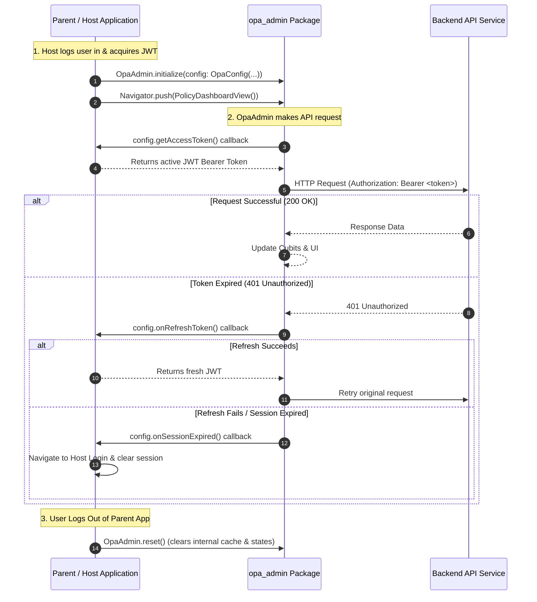

# OPA Admin — Package Conversion Architecture & Implementation Plan

> **Document Version:** 1.0.0  
> **Status:** Planning / Architecture Approved  
> **Target Project:** `opa_admin` (converting to a reusable Flutter module / package)

---

## 1. Executive Summary & Background

In previous architectural discussions, we analyzed converting `opa_admin` from a standalone Flutter application into an **embeddable, reusable Flutter package** (Feature SDK / Micro-Frontend module). This package will be consumed across multiple parent/host projects without duplicating business logic, policy authorization rules, or UI components.

### Core Problem & Decision Recap
1. **No Independent Auth Screens:** `opa_admin` will **not** contain login, signup, or password reset screens. The host/parent application is the source of truth for user authentication and session lifecycle.
2. **JWT Bridge (Inversion of Control):** Instead of `opa_admin` reading local secure storage directly or expecting specific auth tables, the package defines an **Auth Contract (`OpaConfig`)**. The parent application supplies the live JWT access token and refresh handlers via callbacks.
3. **Isolated Dependency Injection:** Using `GetIt.instance` inside a package causes registration conflicts if the parent project also uses GetIt. `opa_admin` must use an isolated instance (`GetIt.asNewInstance()`).
4. **Single Source of Truth for Localization:** Multilingual translation will remain handled through `lib/core/l10n`, exposing delegates for the parent app's `MaterialApp`.
5. **Dual-Mode Capability:** The package will provide a public entry file (`lib/opa_admin.dart`) for consumers, while keeping a standalone runnable harness (`lib/main.dart` or `example/`) for development and local testing.

---

## 2. Architecture & Flow Diagram

### 2.1 Auth Provider Contract Flow
The sequence below illustrates how the parent app communicates with `opa_admin` and the backend services:



---

## 3. Core Architectural Modules to Refactor

### 3.1 Contract Definition: `OpaConfig` & `OpaAdmin`
We will create `lib/core/config/opa_config.dart` and `lib/opa_admin.dart`:

```dart
typedef TokenProvider = Future<String?> Function();
typedef RefreshTokenHandler = Future<String?> Function();
typedef SessionExpiredCallback = void Function();

class OpaConfig {
  /// The backend API base URL for OPA Admin services
  final String baseUrl;

  /// Callback supplied by the parent app to retrieve the current active JWT
  final TokenProvider getAccessToken;

  /// Optional callback to trigger token refresh in the parent app on 401
  final RefreshTokenHandler? onRefreshToken;

  /// Optional callback invoked when the session is expired/unauthorized
  final SessionExpiredCallback? onSessionExpired;

  const OpaConfig({
    required this.baseUrl,
    required this.getAccessToken,
    this.onRefreshToken,
    this.onSessionExpired,
  });
}
```

And the static SDK controller `OpaAdmin`:
```dart
class OpaAdmin {
  static OpaConfig? _config;
  static OpaConfig get config => _config!;
  static bool get isInitialized => _config != null;

  /// Initialize package dependencies with host config
  static Future<void> initialize({required OpaConfig config}) async {
    _config = config;
    await initPackageServiceLocator(config);
  }

  /// Reset internal state, caches, and cubits upon host user logout
  static Future<void> reset() async {
    await resetPackageServiceLocator();
  }
}
```

---

### 3.2 Isolated Dependency Injection (`service_locator.dart`)
* **Current State:** Uses `final sl = GetIt.instance;` (global singleton).
* **Problem:** If a parent app registers `Dio` or `SharedPreferences` in `GetIt.instance`, collision throws an exception.
* **Solution:** 
  ```dart
  // In lib/core/service_locator.dart
  final GetIt sl = GetIt.asNewInstance();
  ```
* All internal services (`sl<Dio>()`, `sl<PolicyRepository>()`, `sl<PolicyCubit>()`) are registered into this isolated container, invisible to and safe from the host app.

---

### 3.3 Network Layer Decoupling (`TokenManager` & `AuthInterceptor`)
* Update `TokenManager`:
  * Instead of strictly reading from `SecureStoreImpl`, query `OpaAdmin.config.getAccessToken()`.
  * If the host app passes an `onRefreshToken` callback, invoke it when handling 401s.
* Update `AuthInterceptor`:
  * In `onRequest`: Attach `Bearer ${await config.getAccessToken()}`.
  * In `onError` (401/403): If refresh callback is provided, invoke it, update token, and replay queued requests. If refresh fails or callback is null, trigger `config.onSessionExpired?.call()`.
* Remove hardcoded GetX navigation calls (e.g. `Get.offAllNamed(AppRoutes.login)`), delegating navigation back to the host app.

---

### 3.4 Localization Strategy (`lib/core/l10n`)
* **Rule Compliance:** Must strictly maintain `lib/core/l10n` for language switching.
* `AppLocalizations` delegates and supported locales will be exposed:
  ```dart
  export 'src/core/l10n/app_localizations.dart';
  ```
* In the host app's `MaterialApp`, developers add `AppLocalizations.delegate` to `localizationsDelegates`.
* When the host application changes its active `Locale`, `opa_admin` widgets will automatically re-render in the corresponding language.

---

### 3.5 Reusable Design System & Guidelines
* **Rule Compliance:**
  1. `lib/core/design/widgets`: Use reusable input widgets (`textformfield`, `dropdown`, `button`).
  2. Responsive design for Web and Tablet layouts (retain breakpoints and flexible grid/table views).
  3. Domain-specific reusable widgets kept in `lib/features/department/widgets`.
  4. Global feedback notifications must use `showCustomSnackBar` from `lib/core/shared/snackbar.dart`.
  5. Asset and font resolution: All package-bundled assets must reference `package: 'opa_admin'`.

---

### 3.6 Navigation & Embedding
* **Current State:** `AppRoot` wraps screens with `GetMaterialApp` and fixed routes.
* **Package Architecture:** 
  * Host apps will directly push or embed `PolicyDashboardView()`.
  * **Strict Theme Isolation:** Package views will **not** inherit the host app's theme. Every exported view will be self-contained and wrapped in `Theme(data: AppTheme.dentalTheme, child: ...)` to guarantee that the package's design, typography, card styles, buttons, dialogs, and colors remain consistent, predictable, and unaffected by the parent app's styles.
  * `AppRoot` and `lib/main.dart` will be retained as an internal development harness for running `flutter run -d chrome` during package development.

---

## 4. Public API Surface (`lib/opa_admin.dart`)

Only the intended public interfaces will be exported to consumer apps:

```dart
library opa_admin;

// Core Configuration & Facade
export 'core/config/opa_config.dart';
export 'core/opa_admin_facade.dart';

// Public Feature Views
export 'features/policy/presentation/view/policy_dashboard_view.dart';

// Localization
export 'core/l10n/app_localizations.dart';

// Optional Design Theme & Reusable Components (if host needs them)
export 'core/design/theme/app_theme.dart';
```

All other files (datasources, usecases, internal cubits, network clients) remain private internal implementation details.

---

## 5. Host Application Integration Guide

Here is what consumer / parent projects need to do to use `opa_admin`:

### Step 1: Add Dependency in `pubspec.yaml`
```yaml
dependencies:
  flutter:
    sdk: flutter
  opa_admin:
    git:
      url: https://github.com/your-org/opa_admin.git
      ref: main
    # Or local path during development:
    # path: ../opa_admin
```

### Step 2: Initialize in Parent App (`main.dart` or after Login)
```dart
import 'package:opa_admin/opa_admin.dart';

void main() async {
  WidgetsFlutterBinding.ensureInitialized();

  await OpaAdmin.initialize(
    config: OpaConfig(
      baseUrl: 'https://api.yourdomain.com',
      getAccessToken: () async {
        // Read token from parent app's auth storage (e.g. FlutterSecureStorage)
        return await myParentAuthService.getToken();
      },
      onRefreshToken: () async {
        // Parent app refreshes token
        return await myParentAuthService.refreshToken();
      },
      onSessionExpired: () {
        // Parent app handles logout / redirect
        parentNavigatorKey.currentState?.pushReplacementNamed('/login');
      },
    ),
  );

  runApp(const ParentApp());
}
```

### Step 3: Register Localization Delegates in `MaterialApp`
```dart
MaterialApp(
  locale: currentParentLocale,
  localizationsDelegates: const [
    ...GlobalMaterialLocalizations.delegates,
    AppLocalizations.delegate, // <-- Exposes opa_admin translations
  ],
  supportedLocales: AppLocalizations.supportedLocales,
  home: const ParentHomeScreen(),
);
```

### Step 4: Open OPA Admin Screen
```dart
Navigator.of(context).push(
  MaterialPageRoute(
    builder: (context) => const PolicyDashboardView(),
  ),
);
```

### Step 5: Clean Up on Logout
```dart
// In parent app logout function:
await OpaAdmin.reset();
```

---

## 6. Phased Implementation Roadmap

| Phase | Milestone | Key Tasks |
| :--- | :--- | :--- |
| **Phase 1** | **Contracts & Config** | 1. Create `OpaConfig` and `OpaAdmin` facade.<br>2. Define token, refresh, and session callback contracts. |
| **Phase 2** | **Isolated DI Container** | 1. Update `lib/core/service_locator.dart` to use `GetIt.asNewInstance()`.<br>2. Provide `initPackageServiceLocator(OpaConfig)` and `resetPackageServiceLocator()`. |
| **Phase 3** | **Network & Token Decoupling** | 1. Refactor `TokenManager` to read from `OpaConfig.getAccessToken`.<br>2. Refactor `AuthInterceptor` to handle refresh/session callbacks and remove hardcoded GetX redirects.<br>3. Decouple `AppDioClient` base URLs using `OpaConfig`. |
| **Phase 4** | **Localization & Widgets Audit** | 1. Verify `lib/core/l10n` exports and dynamic language switching.<br>2. Ensure reusable form fields, buttons, dropdowns in `lib/core/design/widgets` meet responsive web/tablet criteria.<br>3. Verify department reusable widgets in `lib/features/department/widgets`.<br>4. Validate `showCustomSnackBar` usage. |
| **Phase 5** | **Public Entry & Pubspec** | 1. Create `lib/opa_admin.dart` with clean public exports.<br>2. Update `pubspec.yaml` metadata, assets, and dependencies. |
| **Phase 6** | **Dual-Mode Dev Harness** | 1. Update `lib/main.dart` so it mocks/initializes `OpaAdmin` with dev credentials for local `flutter run` testing. |
| **Phase 7** | **Testing & Verification** | 1. Run `flutter analyze` and resolve all lint issues.<br>2. Test running on Chrome (`flutter run -d chrome`).<br>3. Verify compilation when imported as a local path package. |

---

## 7. Approval & Next Steps

This plan preserves full backward compatibility for local development while turning `opa_admin` into an enterprise-ready, embeddable Flutter package. 

When you are ready to begin execution, we will start with **Phase 1 & Phase 2**.
